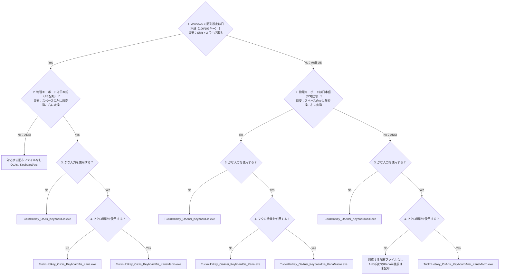

# TucknHotkey

[English](README_en.md)

TucknHotkey は、Windows の移動・編集・記号入力をホームポジション付近へ集めるキーボード／マウス用ツールです。
キーやマウスボタンの組み合わせで、使用中のアプリへ移動・選択・貼り付けなどの操作を送ります。
Keyboard と Mouse は別々のプログラムなので、必要なものだけ起動できます。

例えば、JIS キーボードでは次の操作ができます。

| 入力する操作 | 得られる動作 |
| --- | --- |
| 変換を押しながら H / J / K / L | カーソルを左／下／上／右へ移動 |
| 変換と無変換を押しながら H / J / K / L | 同じ方向へ選択範囲を広げる |
| `KanaMacro` 版で変換と M を押しながら D | 現在の日付を貼り付ける。例：`20260921` |

日付は形式を示す説明例で、実際には PC の現在日付が入力されます。

初めて使う場合は、[はじめに確認すること](#はじめに確認すること)から[ダウンロードと起動](#ダウンロードと起動)まで順に進めてください。
起動後は、[日常の操作](#日常の操作)、[キー配置](#キー配置)、[設定](#設定)を目的に応じて参照できます。
Mouse だけを使う場合は、[Mouse を使う場合](#mouse-を使う場合)で準備とファイル名を確認してください。

## はじめに確認すること

配布 exe は **x64 Windows 向け**で、AutoHotkey v2 で作成しています。
AutoHotkey のインストールは不要です。
AHK v1 版と x86 版の exe は配布しません。

Keyboard は Windows の配列設定、物理キーボード、入力方式に合わせて選びます。
起動中はキーの動作が変わるため、**Keyboard は最大 1 種類、Mouse は最大 1 種類**にしてください。
exe 版と `.ahk` 版を併用する場合も同じです。

本書の **Nav** は移動・編集用、**Select** は Shift 相当の選択・修飾入力用のキーです。
押している間に他のキーと組み合わせて使い、両方を押すと移動と選択を組み合わせられます。

| 物理キーボード | Nav | Select |
| --- | --- | --- |
| JIS | 変換 | 無変換 |
| ANSI（US 配列） | 右 Alt | 左 Alt |

設定ファイルを作らなくても起動できます。
クリップボードツールの呼び出しなど、追加の設定が必要な機能は[設定](#設定)で説明します。

## Keyboard の選び方

`OsJis` / `OsAnsi` は Windows の**キーボード配列設定**です。
Windows の表示言語ではありません。
`KeyboardJis` / `KeyboardAnsi` は物理キーボードの種類です。

### ファイル選定フロー

以下は、Windows の配列設定が日本語（106/109 キー）または英語（US）、物理キーボードが JIS または ANSI（US 配列）の場合のフローです。
他の配列や不明な場合は、設定・製品仕様を確認してから選んでください。
「日本語ではない」だけで英語（US）とは限りません。



#### 確認方法・用語の補足

- **Windows の配列設定**：本ツールや他のキー割り当て変更ツールを終了し、IME をオフ（半角英数字の直接入力）にして、メモ帳などで上段の `Shift + 2` を押します。
  日本語配列では `"`、英語（US）配列では `@` が出るのが目安です。
  本ツールの起動中は記号の配置を変更するため、この判定には使えません。
- **物理キーボード**：日本語（JIS 配列）は通常、スペースの左に「無変換」、右に「変換」があります。
  「106/109 キー」は配列を表す呼び方で、テンキーレスやノート PC で実際にその数のキーが必要という意味ではありません。
  キーの刻印が異なる製品もあるため、見た目だけで不明な場合は製品仕様を確認してください。
- **かな入力**：キーに対応する「かな」を直接入力する方式です。
  「日本語を入力する」「ひらがなを表示する」という意味ではありません。
  ローマ字入力だけを使う場合は質問 3 で **No**、かな入力を使う場合（ローマ字入力との切り替えを含む）は **Yes** を選びます。
  入力方式については [Microsoft 日本語 IME の説明](https://support.microsoft.com/ja-jp/windows/microsoft-japanese-ime-da40471d-6b91-4042-ae8b-713a96476916) も参照してください。
- **マクロ機能**：本ツールの [KanaMacro](#kanamacro) にある、日付の貼り付けなどの作者定義の操作です。
  キーボード製品のマクロ機能や、自由に操作を記録する機能ではありません。
  現在、マクロ付きの配布版は `KanaMacro` のみで、ローマ字入力専用のマクロ版はありません。
  そのため、質問 3 が **No** の場合はマクロなしの通常版へ進みます。

### 配布ファイル一覧

| Windows のキーボード設定 | 物理キーボード | 入力・機能 | 起動する exe |
| --- | --- | --- | --- |
| 日本語・106/109 キー | JIS | ローマ字入力 | `TucknHotkey_OsJis_KeyboardJis.exe` |
| 日本語・106/109 キー | JIS | かな入力 | `TucknHotkey_OsJis_KeyboardJis_Kana.exe` |
| 日本語・106/109 キー | JIS | かな入力＋作者のマクロ | `TucknHotkey_OsJis_KeyboardJis_KanaMacro.exe` |
| 英語・101/102 キー | JIS | ローマ字入力 | `TucknHotkey_OsAnsi_KeyboardJis.exe` |
| 英語・101/102 キー | JIS | かな入力 | `TucknHotkey_OsAnsi_KeyboardJis_Kana.exe` |
| 英語・101/102 キー | JIS | かな入力＋作者のマクロ | `TucknHotkey_OsAnsi_KeyboardJis_KanaMacro.exe` |
| 英語・101/102 キー | ANSI | ローマ字入力 | `TucknHotkey_OsAnsi_KeyboardAnsi.exe` |
| 英語・101/102 キー | ANSI | かな入力＋作者のマクロ | `TucknHotkey_OsAnsi_KeyboardAnsi_KanaMacro.exe` |

現在、ANSI キーボード向けの `Kana` 単独版、および `OsJis_KeyboardAnsi` はありません。

## ダウンロードと起動

### exe で起動する

1. [Releases](https://github.com/tuckn/AhkTucknHotkey/releases) から `TucknHotkey-v<version>-win-x64.zip` をダウンロードします。
   `<version>` は Release のバージョン番号です。
   GitHub の **Source code (zip)** はソース用であり、exe は入っていません。
2. ZIP を展開し、`TucknHotkey` フォルダを開きます。
   アイコンと設定ファイルは exe と同じフォルダに置いてください。
3. [配布ファイル一覧](#配布ファイル一覧)で選んだ Keyboard の exe をダブルクリックします。
   例えば、Windows が日本語配列、物理キーボードが JIS、ローマ字入力を使う場合は `TucknHotkey_OsJis_KeyboardJis.exe` です。

プログラムは通知領域（タスクトレイ）に常駐します。
アイコンにマウスポインターを重ねるとファイル名が表示されるので、選んだ種類が起動したことを確認してください。
Keyboard を起動しても Mouse は自動起動しません。
Mouse を追加する場合は、[Mouse を使う場合](#mouse-を使う場合)へ進みます。

### 起動後に動作を確認する

メモ帳で、次の順にカーソル移動と選択を確認します。

1. IME をオフにし、`abc` と入力してカーソルを末尾へ置きます。
2. Nav を押したまま H を 1 回押します。
   カーソルが `b` と `c` の間へ移動すれば、左移動が動作しています。
3. いったんキーを離し、Nav と Select を押したまま L を 1 回押します。
   `c` が選択されれば、移動と選択の組み合わせが動作しています。

JIS では Nav が変換、Select が無変換です。
ANSI では Nav が右 Alt、Select が左 Alt です。
動作が合わない場合は、トレイアイコンを右クリックして **Exit** で終了し、[困ったとき](#困ったとき)を確認してください。

### 会社のポリシーなどで exe を実行できない場合

AutoHotkey の利用が許可されていても、配布 exe は別の実行ファイルとして判定され、実行を制限される場合があります。
AutoHotkey と自作スクリプトの利用が許可されている環境では、対応する AutoHotkey で `.ahk` スクリプトを開いて実行してください。

1. [Releases](https://github.com/tuckn/AhkTucknHotkey/releases) の対象バージョンから **Source code (zip)** を取得し、展開します。
   実行用 ZIP には `.ahk` は含まれません。
2. 使用が許可されている AutoHotkey のバージョンに合わせて、次のフォルダを選びます。

   | 使用する AutoHotkey | スクリプトのフォルダ |
   | --- | --- |
   | AutoHotkey v1.1.33 以降（v1.1 系） | `src/v1/` |
   | AutoHotkey v2 | `src/v2/` |

3. [配布ファイル一覧](#配布ファイル一覧)で選んだ exe と同じ名前の `.ahk` を、そのバージョンの AutoHotkey で開きます。
   例えば `TucknHotkey_OsJis_KeyboardJis.exe` に対応するのは `TucknHotkey_OsJis_KeyboardJis.ahk` です。
   対応する AutoHotkey に関連付けられていれば、ダブルクリックで起動できます。
   別のバージョンやエディターで開く場合は、右クリックの「プログラムから開く」で対応する AutoHotkey の実行ファイルを指定してください。
4. トレイに表示されたファイル名を確認し、[起動後の動作確認](#起動後に動作を確認する)を行います。

v1.1 用と v2 用のスクリプトには互換性がないため、フォルダと実行する AutoHotkey のバージョンを合わせてください。
アイコン・設定ファイルなどを移動せず、展開したフォルダ構成のまま使用します。
設定は選んだフォルダ内の `TucknHotkey.ini` を編集します。
Mouse も同様に対応する `.ahk` を選びます。

## 日常の操作

トレイアイコンを右クリックして、使用中のプログラムを操作します。
Keyboard と Mouse を両方使っている場合は、それぞれのアイコンで操作してください。

| 目的 | 操作 | 結果・確認方法 |
| --- | --- | --- |
| キー割り当てを一時停止する | **Suspend Hotkeys** | ホットキーが無効になり、メニューにチェックが付きます。もう一度選ぶと再開します。 |
| 設定変更を反映する | **Reload This Script** | プログラムを再読み込みします。変更した機能を試して反映を確認します。 |
| 終了する | **Exit** | プログラムが終了し、トレイアイコンが消えます。 |
| 再び使う | 使用する exe または `.ahk` を起動する | トレイのファイル名で起動した種類を確認します。 |

ノート PC と外付けキーボードを使い分ける場合は、以前の Keyboard を **Exit** で終了してから切り替え先を起動してください。
入力元の物理キーボードを自動判別する機能はありません。
Mouse も物理キーボードの種類に合わせて切り替えます。

## キー配置

以下の図は **OsJis / KeyboardJis** 向けです。
ANSI 環境などでは物理的なトリガーキーが異なるため、そのまま適用しないでください。
物理キーボードごとの Nav / Select キーは、[はじめに確認すること](#はじめに確認すること)を参照してください。

図の赤系のキー入力を、ホームポジション付近の緑系のキーで入力できます。


### 通常時

黄色は JIS 配列と異なる記号が出る位置です。
記号は ANSI 配列の配置を採用しています。
この JIS 向けの設定では、CapsLock は Esc、右 Alt は Ctrl として動作します。


### Select（無変換）

Shift 相当の選択・修飾入力を提供します。


### Nav（変換）

矢印、移動・編集キー、ファンクションキーなどをホームポジション付近へ集めます。


### Nav + Select

移動と選択を組み合わせます。
図の赤字は Shift 同時押しを示します。


## KanaMacro

`KanaMacro` は、かな入力への対応に加え、作者の操作習慣に合わせたマクロを含む任意のバリエーションです。
マクロは日付の貼り付けなど、あらかじめ定義された操作です。
割り当てはソースで定義しており、ini からは変更できません。

**Nav と M を押したまま**、次のキーを押します。

| キー | 動作 |
| --- | --- |
| D | 現在の日付を ISO 8601 基本形式で貼り付け |
| F | 現在のローカル日時を ISO 8601 基本形式で貼り付け |
| H / L | 前／次の表示へ切り替え。ブラウザではタブなど、対象アプリに応じて動作します。 |
| C | [設定したクリップボードツール](#クリップボードツールを設定する)を起動 |
| V | クリップボードをプレーンテキストで貼り付け |

D / F に Select を加えると、ISO 8601 拡張形式になります。
次は、PC のローカル日時が 2026 年 9 月 21 日 13 時 20 分 15 秒、UTC との差が +09:00 の場合の説明例です。

| 入力する操作 | 貼り付ける文字列の例 |
| --- | --- |
| Nav + M + D | `20260921` |
| Nav + M + F | `20260921T132015+0900` |
| Nav + Select + M + D | `2026-09-21` |
| Nav + Select + M + F | `2026-09-21T13:20:15+09:00` |

日付・日時とプレーンテキストの貼り付けは、入力先のカーソル位置へ文字列を送ります。
内部ではクリップボードを一時的に使い、貼り付け後に元の内容へ戻します。

## Mouse を使う場合

Mouse は Keyboard と独立しており、単独でも使用できます。
マウスの設定ソフトで、ボタンに **F10 / F11 / F12** を割り当てられることが前提です。
物理キーボードの種類に合わせて、次のプログラムを選びます。

| 物理キーボード | 起動する exe |
| --- | --- |
| JIS | `TucknMouseKey_KeyboardJis.exe` |
| ANSI | `TucknMouseKey_KeyboardAnsi.exe` |

1. [ダウンロードと起動](#ダウンロードと起動)の手順で実行用 ZIP を展開します。
   Mouse だけを使う場合は、Keyboard の exe を起動する手順を省略します。
2. マウスの設定ソフトで、使用するボタンに F10 / F11 / F12 を割り当てます。
3. 上表の Mouse の exe を 1 種類だけ起動し、トレイのファイル名を確認します。
4. メモ帳に複数行の文字を入力し、F10 を割り当てたボタンを押しながら E を押します。
   カーソルが上へ移動すれば、ボタンとキーを組み合わせた操作が動作しています。

| 割り当てるキー | 用途 | 操作例 |
| --- | --- | --- |
| F10 | 移動・ウィンドウ操作 | 押しながら E / S / D / F で上／左／下／右へ移動 |
| F11 | マウスジェスチャー | 押しながらマウスを左へ動かしてボタンを離すと、対応アプリで前の場所・履歴へ戻る |
| F12 | 編集操作 | 押しながら C でコピー、V でプレーンテキスト貼り付け |

通常時のボタン操作とホイール加速も提供します。
戻る／進むボタンは、対象アプリの前／次の表示へ切り替える操作になります。
加速の調整や除外アプリの指定は、[ホイール加速を設定する](#ホイール加速を設定する)を参照してください。

## 設定

### 設定ファイルを変更する

exe 版の ZIP には、そのまま使える `TucknHotkey.ini` が入っています。
IME ON の目印は初期状態で有効です。設定を変更するときは、次の手順で編集します。

1. exe と同じフォルダにある `TucknHotkey.ini` を開きます。
   編集済みの設定を引き継いでいる場合は、そのファイルを編集してください。
2. 必要な項目をテキストエディターで変更して保存します。
   ファイル名が `TucknHotkey.ini.txt` になっていないことを確認してください。
3. 使用中のプログラムのトレイメニューで **Reload This Script** を選び、変更した操作を試します。

同じフォルダの Keyboard と Mouse は、同じ `TucknHotkey.ini` を読みます。
Mouse 専用の ini はありません。
両方に関係する設定を変更した場合は、それぞれを再読み込みしてください。

`.ahk` 版では、選んだ `src/v1/` または `src/v2/` にある `TucknHotkey.ini` を編集します。
各フォルダの設定は独立しており、個人パスを含まない配布既定値が入っています。

### IME ON の目印を表示する

IME が ON のときだけ、キャレット（文字の入力位置）の右下に短い横線を表示できます。キャレットの右へ5px、下端より2px内側に配置し、入力中の行に収めます。横線の太さは2pxです。
配布用INIでは既定で有効です。実行中の Keyboard と同じフォルダの `TucknHotkey.ini` で次の設定を変更し、Keyboard を再読み込みしてください。無効にする場合は `enabled=0` にします。
既存の設定ファイルがある場合は、他のセクションを残してください。

```ini
[ImeIndicator]
enabled=1
color=#E07000
size_px=10
```

- `enabled`: `1` / `true` / `on` / `yes` で有効。それ以外・未設定は無効。
- `color`: `#RRGGBB` または `RRGGBB`。未設定・不正値はオレンジ `#E07000`。
- `size_px`: 横線の幅のピクセル数（3〜24）。未設定・不正値は `10`。既存の指定値はそのまま幅に使います。

目印はクリックと入力フォーカスを奪わず、約100ms間隔で追従します。
IME OFF、IME状態やキャレット位置の取得失敗時、トレイからの一時停止・終了時は非表示になります。
再読み込みで設定を反映します。Windows のテキストカーソル設定は変更しません。
Keyboard 側だけで表示するため、Mouse を併用しても目印は重複しません。

標準のキャレット座標を取得できないアプリ・入力欄では表示できません。
アプリが誤った位置を返す場合もあり、**目印がないことだけでは IME OFF と断定できません**。
この機能はIMEのON/OFFを示し、ひらがな・カタカナなどの変換モードは区別しません。

### クリップボードツールを設定する

`[Tools]` の `ClipboardToolCommand` に、呼び出すツールの実行コマンドを設定します。
初期状態は空欄です。
未設定で呼び出すと、設定ファイルの場所を示す通知が表示されます。

以下は、Clibor を呼び出す場合の **`[Tools]` 部分の抜粋**です。
既存の `[Tools]` 内の `ClipboardToolCommand` を変更し、他の項目や `[Mouse]` は残してください。
例のパスは、自分の環境にある Clibor の実行ファイルのパスへ置き換えます。

```ini
[Tools]
ClipboardToolCommand="C:\path\to\Clibor\Clibor.exe" /vc
```

Clibor 自体は同梱しません。
`KanaMacro` 版で Nav + M + C を押し、指定したツールが起動することを確認します。
起動失敗の通知が出た場合は、実行ファイルの場所と引数を確認してください。

### ホイール加速を設定する

`[Mouse]` は、Mouse プログラムの通常ホイール操作を調整します。
同じ方向へ短い間隔で回すとスクロール量が増え、入力間隔が空くか方向が変わると連続入力の数え方がリセットされます。

**同梱INIの値と、設定を省略したときの値は一部異なります。**
exe 版・`.ahk` 版の同梱 `TucknHotkey.ini` を使う場合は、表の「配布既定値」が適用されます。

| キー | 何を変えるか | 配布既定値 | 省略時の値 |
| --- | --- | --- | --- |
| `accelerated_scroll_enabled` | 加速の有効／無効。`0` / `false` / `off` / `no` で無効 | `1`（有効） | `1`（有効） |
| `disabled_apps` | 加速しないアプリの実行ファイル名。カンマ区切り | `Photoshop.exe,i_view64.exe` | 空欄（除外なし） |
| `accelerated_scroll_timeout_ms` | 同方向の入力を連続とみなす間隔の上限。1～5000 ミリ秒 | `500` | `500` |
| `accelerated_scroll_fast_interval_ms` | 高速入力とみなす間隔の上限。1～500 ミリ秒 | `80` | `60` |
| `accelerated_scroll_start_distance` | 最初の入力後、加速開始までに必要な連続入力数。1～50 | `2` | `3` |
| `accelerated_scroll_curve` | 入力間隔から加速量を求める係数。1～5000。大きいほど加速量が増加 | `250` | `250` |
| `accelerated_scroll_boost` | 追加の加速を始める連続入力数の基準。0～1000。0 / 1 で追加の加速を無効化 | `30` | `30` |
| `accelerated_scroll_limit` | ホイール入力 1 回あたりに送るスクロール回数の上限。1～300 | `80` | `80` |

数値項目が空欄、整数以外、範囲外の場合は、「省略時の値」へ戻ります。
`accelerated_scroll_enabled` は無効を表す値以外では有効になり、大文字・小文字は区別しません。
`disabled_apps` は実行ファイル名の大文字・小文字を区別しません。
互換用のキー `accelerated_scroll_disabled_apps` がある場合は、`disabled_apps` が空欄または省略されたときに使われます。
両方とも空欄または省略なら、除外アプリはありません。

加速を止めたい場合は、既存の `[Mouse]` 内で `accelerated_scroll_enabled=0` に変更します。
Mouse を再読み込みし、ホイールを速く回しても加速しないことを確認してください。
除外アプリの指定は、ホイール加速だけに適用されます。

## 更新方法

### exe 版を更新する

1. 使用中の Keyboard と Mouse を、トレイメニューの **Exit** で終了します。
2. 新しい実行用 ZIP を別のフォルダへ展開し、編集済みの `TucknHotkey.ini` を新しい exe と同じフォルダへコピーします。
3. 使用するプログラムを再起動し、トレイのファイル名と[キー操作](#起動後に動作を確認する)を確認します。

ZIP には配布既定値の `TucknHotkey.ini` が入っています。既存フォルダへ上書き展開すると個人設定も置き換わるため、更新前に編集済みのINIを保存してください。
新しい設定項目が必要な場合は、同梱INIと比較して追加してください。

### .ahk 版を更新する

使用中のプログラムを終了し、新しい Release の **Source code (zip)** を別のフォルダへ展開します。
編集済みの `TucknHotkey.ini` を保存しておき、新しい `src/v1/` または `src/v2/` の対応するフォルダへ引き継いでから再起動してください。
ソース用 ZIP には配布既定値の `TucknHotkey.ini` が入っているため、既存フォルダへそのまま上書きすると個人設定も置き換わります。

## 困ったとき

入力がおかしくなった場合は、まず Keyboard と Mouse を **Exit** で終了してください。
その後、次の項目を確認します。

| 症状 | 確認・対処 |
| --- | --- |
| exe が見つからない | **Source code (zip)** ではなく、`TucknHotkey-v<version>-win-x64.zip` を取得したか確認します。 |
| 移動や記号入力が想定と違う | 複数種類が動いていないか、Windows の配列設定と物理キーボードに合うファイルを選んだか確認します。 |
| 設定が反映されない | 実行中の exe または `.ahk` と同じフォルダの `TucknHotkey.ini` を編集したか確認し、再読み込みします。 |
| `.ahk` がエラーになる、またはエディターで開く | `src/v1/` / `src/v2/` と、実行に使う AutoHotkey のバージョンを合わせます。 |
| Shift / Ctrl / Alt / Win が押されたままに見える | 各キーを一度押して離します。JIS の Keyboard 起動中は、Nav + Select + CapsLock でも修飾キーの押しっぱなし状態を解除できます。 |
| Nav + Select + 対象キーが反応しない | 一部のノート PC では、3 キー同時押しが Windows まで届かない場合があります。選択操作では Nav + 物理 Shift + 対象キー、または外付けキーボードを試します。 |

## ソースと詳細な割り当て

公開リポジトリの `src/v1/` と `src/v2/` に、全種類の生成済みスクリプト、アイコン、設定例を置いています。
選んだ種類の `.ahk` スクリプトで、詳しい割り当てを確認できます。

Remote-Limited JIS はソースのみ公開し、exe は配布しません。
特定バージョンの exe に対応するソースは、同じ Release タグから取得してください。
実行用 ZIP にはソースディレクトリを重複して同梱しません。

| 調べたいこと | 参照先 |
| --- | --- |
| 配布ファイルと各バージョンのソースを取得する | [Releases](https://github.com/tuckn/AhkTucknHotkey/releases) |
| 公開されているスクリプトを読む | [AhkTucknHotkey リポジトリ](https://github.com/tuckn/AhkTucknHotkey)の `src/v1/` / `src/v2/` |
| 利用・再配布条件を確認する | [LICENSE](LICENSE) |

## ライセンス

独自スクリプト・文書・アセットは MIT License です。
exe に含まれる AutoHotkey コンポーネントの通知とライセンス本文は [LICENSE](LICENSE) に同梱しています。
