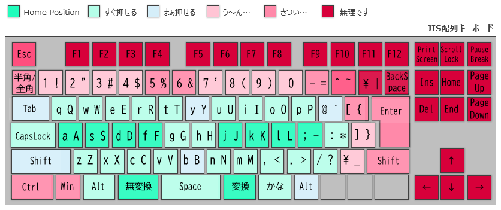
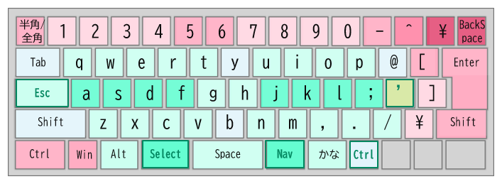
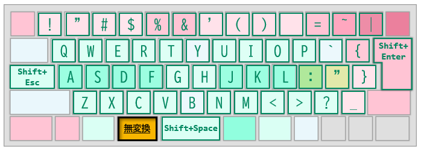
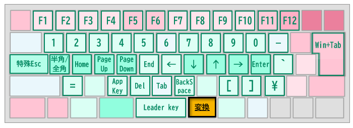
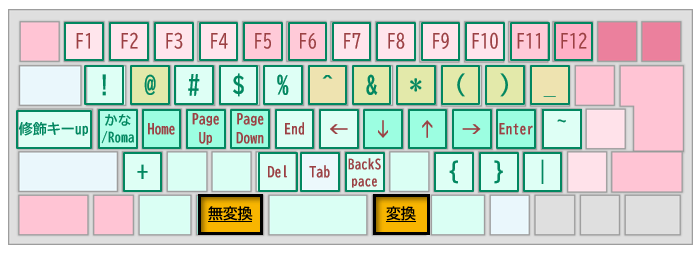

# TucknHotkey

[日本語](README.md)

TucknHotkey is a Windows keyboard and mouse utility that brings navigation,
editing, and symbols closer to the home row. Keyboard and mouse programs run separately;
start only the ones you need.

## Download and start

1. Download `TucknHotkey-v<version>-win-x64.zip` from [Releases](https://github.com/tuckn/AhkTucknHotkey/releases).
   This is the executable package; GitHub's **Source code (zip)** is for source files.
2. Extract the ZIP and open the `TucknHotkey` folder.
3. Choose **one keyboard executable** from the table below. Optionally start **one matching mouse executable**.

The executable package targets x64 Windows and is built with AutoHotkey v2.
You do not need to install AutoHotkey. AHK v1 executables and x86 executables are not distributed.
Keep the icons and configuration beside the executables.

### If company policy prevents running the executables

Even if AutoHotkey is permitted, the distributed executables may be treated as separate applications and blocked.
If your organization permits AutoHotkey and custom scripts, open the `.ahk` script with the corresponding AutoHotkey version.

1. Download **Source code (zip)** for the desired version from [Releases](https://github.com/tuckn/AhkTucknHotkey/releases) and extract it. The executable package does not include `.ahk` files.
2. Choose the folder that matches the AutoHotkey version you are permitted to use.

   | AutoHotkey version | Script folder |
   | --- | --- |
   | AutoHotkey v1.1.33 or later (v1.1 series) | `src/v1/` |
   | AutoHotkey v2 | `src/v2/` |

3. Use the selection table below and open the `.ahk` file with the same name as your chosen executable using that AutoHotkey version. For example, `TucknHotkey_OsJis_KeyboardJis.exe` corresponds to `TucknHotkey_OsJis_KeyboardJis.ahk`.
   Double-click the script if it is associated with the correct AutoHotkey version. If it opens in another version or an editor, right-click, choose **Open with**, and select the corresponding AutoHotkey executable.

Scripts for v1.1 and v2 are not interchangeable; match the script folder to the AutoHotkey version used to run it.
Keep the extracted folder structure, including icons and configuration files. Edit `TucknHotkey.ini` inside the selected folder to customize settings.
For the mouse program, choose the matching `.ahk` in the same way. Including any executable versions already running, start at most one keyboard program and one mouse program.

## Choose a keyboard program

`OsJis` / `OsAnsi` describe the Windows **keyboard layout setting**, not its display language.
`KeyboardJis` / `KeyboardAnsi` describe the physical keyboard.

| Windows keyboard setting | Physical keyboard | Input / features | Executable |
| --- | --- | --- | --- |
| Japanese, 106/109 keys | JIS | Romaji | `TucknHotkey_OsJis_KeyboardJis.exe` |
| Japanese, 106/109 keys | JIS | Kana | `TucknHotkey_OsJis_KeyboardJis_Kana.exe` |
| Japanese, 106/109 keys | JIS | Kana + author's macros | `TucknHotkey_OsJis_KeyboardJis_KanaMacro.exe` |
| English, 101/102 keys | JIS | Romaji | `TucknHotkey_OsAnsi_KeyboardJis.exe` |
| English, 101/102 keys | JIS | Kana | `TucknHotkey_OsAnsi_KeyboardJis_Kana.exe` |
| English, 101/102 keys | JIS | Kana + author's macros | `TucknHotkey_OsAnsi_KeyboardJis_KanaMacro.exe` |
| English, 101/102 keys | ANSI | Romaji | `TucknHotkey_OsAnsi_KeyboardAnsi.exe` |
| English, 101/102 keys | ANSI | Kana + author's macros | `TucknHotkey_OsAnsi_KeyboardAnsi_KanaMacro.exe` |

There is currently no Kana-only ANSI keyboard executable.
No `OsJis_KeyboardAnsi` executable is provided.

When switching between a laptop keyboard and an external keyboard, exit the old keyboard
program before starting the other one. These programs do not automatically distinguish
which physical keyboard generated an event. Start at most one keyboard program and one mouse program.
The tray tooltip shows the filename so that you can identify the running variant.

## Optional mouse program

| Physical keyboard | Executable |
| --- | --- |
| JIS | `TucknMouseKey_KeyboardJis.exe` |
| ANSI | `TucknMouseKey_KeyboardAnsi.exe` |

The mouse workflow assumes that your mouse software can assign **F10 / F11 / F12** to buttons:
F10 for navigation, F11 for gestures, and F12 for editing.
The mouse programs also provide base button actions and wheel acceleration.
They are independent programs; starting a keyboard program does not start a mouse program.

## Keyboard layout

The following diagrams illustrate **OsJis / KeyboardJis**.
Other variants have different physical trigger keys; do not use these diagrams as an ANSI layout reference.
JIS uses NonConvert for Select and Convert for Nav. ANSI uses left Alt for Select and right Alt for Nav.

Red keys can be reached through keys near the home row:



### Base

Yellow labels indicate symbol positions that differ from the JIS layout.
Symbols follow ANSI-style positions. CapsLock acts as Escape; right Alt acts as Control on this JIS profile.



### Select

Select provides Shift-like selection and modified input.



### Nav

Nav brings arrows, navigation, editing, and function keys closer to the home row.



### Nav + Select

Combine the two for selection while navigating. Red labels indicate Shift combinations.



## KanaMacro

These variants include the author's customized macros. They are optional and their bindings
are currently defined in the source, not configurable through the ini file.

Hold **Nav + M**, then press:

| Key | Action |
| --- | --- |
| D | Paste the current date in basic ISO 8601 format |
| F | Paste the current local date/time in basic ISO 8601 format |
| H / L | Previous / next view (for example, browser tab) |
| C | Launch the configured clipboard tool |
| V | Paste clipboard text without formatting |

Add Select to D or F for the extended ISO 8601 format.

## Configuration

The ZIP includes a ready-to-use `TucknHotkey.ini` with the IME marker enabled.
To customize settings, edit this file next to the programs and reload them.

The clipboard tool command is empty by default. For Clibor, replace the example path with your own:

```ini
[Tools]
ClipboardToolCommand="C:\path\to\Clibor\Clibor.exe" /vc
```

Clibor is not included. Without a configured command, the clipboard-tool action displays a setup notice.
The `[Mouse]` section controls wheel acceleration and excluded apps.
Missing or invalid mouse values fall back to runtime defaults.
Both programs read the same `TucknHotkey.ini`; there is no separate mouse ini.

### IME ON marker

The bundled configuration shows a short underline at the lower right of the text caret while IME is ON. Edit the following
section to `TucknHotkey.ini` next to the running Keyboard program, then reload Keyboard.
Preserve any existing sections. Set `enabled=0` to disable the marker.

```ini
[ImeIndicator]
enabled=1
color=#E07000
size_px=10
```

- `enabled`: `1`, `true`, `on`, or `yes` enables the marker; other/missing values disable it.
- `color`: `#RRGGBB` or `RRGGBB`; missing/invalid values use orange `#E07000`.
- `size_px`: line width, 3–24 pixels; missing/invalid values use `10`. Existing values are retained as the width.

The line is 2px thick, 5px to the right of the caret, and ends 2px above its bottom edge.
The marker follows the caret approximately every 100 ms without taking focus or clicks.
It hides when IME is OFF, IME/caret information is unavailable, or Keyboard is suspended,
paused from its tray menu, or exited. Reload Keyboard after editing settings.
Only Keyboard owns the marker; running Mouse alongside it does not duplicate it.
Windows text cursor settings are unchanged.

Some apps/fields do not expose a standard caret or report an incorrect position.
**An absent marker does not prove that IME is OFF.** The marker shows IME open status,
not individual conversion modes such as hiragana or katakana.

## Update, suspend, or exit

Exit the running programs before updating. Extract the new ZIP into a separate
folder, copy your edited `TucknHotkey.ini` next to the new executables, then restart your chosen programs.
The ZIP includes default settings as `TucknHotkey.ini`. Extracting over an existing folder can replace your settings; save your edited INI before updating.

Right-click a tray icon and choose **Suspend Hotkeys** to suspend hotkeys, or **Exit** to stop.
If input becomes unexpected, exit the programs first.

On JIS, Nav + Select + CapsLock releases stuck modifiers. You can also press and release
Shift, Ctrl, Alt, and Win once each.
Some laptop keyboards cannot report certain three-key combinations.
Try Nav + physical Shift + the target key, or an external keyboard.

## Source

The repository contains all generated scripts, icons, configuration examples, and binding CSVs
under `src/v1/` and `src/v2/`. Install the corresponding AutoHotkey version to run a source script.
Each source directory includes a sanitized `TucknHotkey.ini`; customize it locally if needed.

The Remote-Limited JIS profile is available as source only.
For a specific executable release, use the source at the matching release tag.
The executable ZIP does not duplicate the source directories.

## License

Original scripts, documentation, and assets use the MIT License.
Compiled executables also include AutoHotkey components; their notices and license text
are included in [LICENSE](LICENSE).
